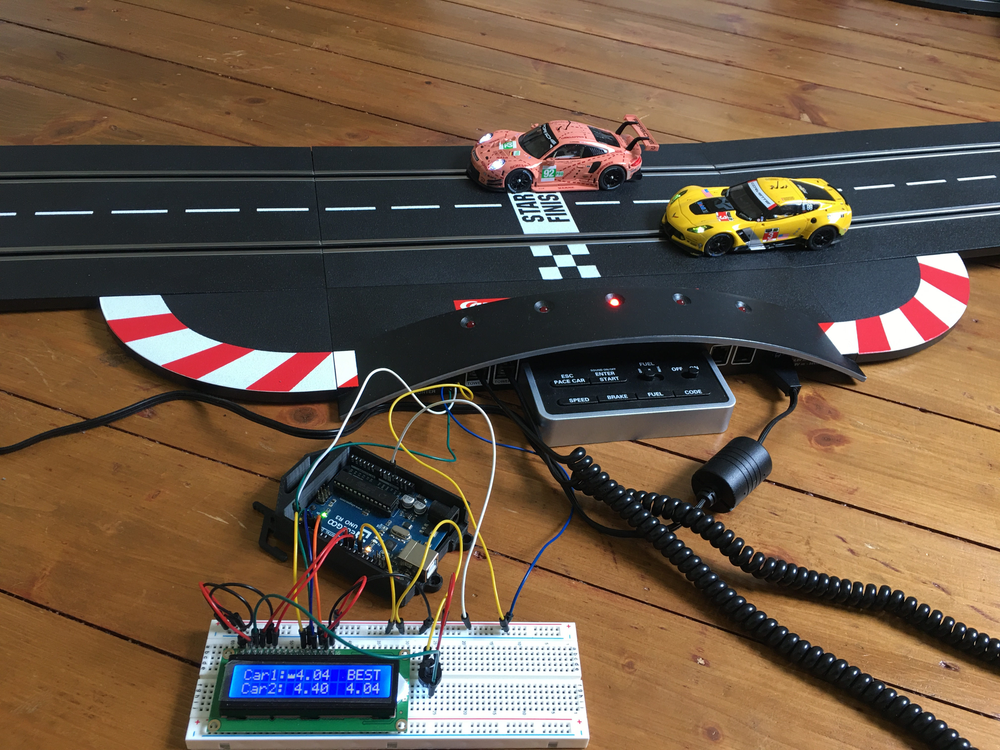

# Carrera Lap Timer (Arduino + LCD)

<p align="center">
  
</p>

This project implements a lap timing system for Carrera racing tracks using an Arduino and a 16x2 LCD display. It measures lap times for two cars via serial communication with the Carrera Control Unit and highlights the fastest lap.

## Overview

The system listens to serial data from the Carrera Control Unit, detects when a car crosses the sensor, and calculates lap times using `millis()`. Each lap is displayed in real time, and the fastest lap is tracked and shown on the display.

A custom LCD character (crown) indicates which car currently holds the best lap time.

## Features

- Real-time lap timing for two cars
- Best lap tracking across both cars
- Visual indicator (crown) for fastest car
- Simple 16x2 LCD interface
- Serial communication with Carrera Control Unit

## Hardware Requirements

- Arduino (Uno, Nano, or compatible)
- 16x2 LCD (HD44780 compatible)
- Carrera Control Unit
- Jumper wires

## Wiring

| LCD Pin | Arduino Pin |
|--------|------------|
| RS     | 11         |
| EN     | 12         |
| D4     | 2          |
| D5     | 3          |
| D6     | 4          |
| D7     | 5          |

## How It Works

1. The Arduino continuously requests data from the Carrera Control Unit via serial communication.
2. Incoming data is read until a delimiter (`$`) is received.
3. The code checks:
   - Which car triggered the sensor
   - Whether the trigger belongs to the relevant sensor group
4. Lap time is calculated using:

```cpp
lapTime = currentMillis - lastLapStart
```

5. The display is updated with:
- Current lap times for both cars
- Best lap time overall
6. The fastest car is marked with a crown symbol on the LCD.

## Important Notes

- The first detected lap for each car is ignored to avoid invalid timing (startup condition).
- Serial communication runs at **19200 baud**.
- The code assumes a fixed data format from the Carrera Control Unit.
- The display is cleared and rewritten for each update, which may cause minor flickering.

## Warranty Disclaimer

Modifying or connecting additional hardware to your Carrera Control Unit may void your manufacturer's warranty.  

This project is provided for educational and experimental purposes only. Use it at your own risk. The author assumes no responsibility for any damage to hardware, loss of warranty, or other issues resulting from the use of this project.

## Limitations

- Uses the Arduino `String` class, which may lead to memory fragmentation on long runtimes
- Serial reading is blocking (`readStringUntil()`), which can affect timing precision
- Currently limited to two cars
- No lap counter or race logic implemented

## Possible Improvements

- Replace `String` with `char` buffers for better memory stability
- Implement non-blocking serial parsing
- Add support for more cars
- Add lap counters and race modes
- Improve LCD update efficiency (reduce flickering)
- Store best times persistently (e.g., EEPROM)

## Getting Started

1. Clone the repository:
```bash
git clone https://github.com/YOUR_USERNAME/carrera-lap-timer.git
```

Open the project in the Arduino IDE:

carrera_lap_timer.ino
Connect the hardware according to the wiring table.
Upload the code to your Arduino.
Power the system and start racing.
